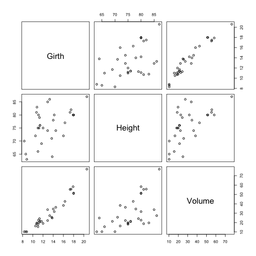

### Showing Datasets Shiny App

#### This Shiny App enables user to quickly take a look at one of the R datasets:
- faithful - dataset containing waiting time between eruptions and the duration of the eruption for the Old Faithful geyser in Yellowstone National Park, Wyoming, USA.
- trees - this data set provides measurements of the girth, height and volume of timber in 31 felled black cherry trees. Note that girth is the diameter of the tree (in inches) measured at 4 ft 6 in above the ground.
- iris - famous (Fisher's or Anderson's) iris data set gives the measurements in centimeters of the variables sepal length and width and petal length and width, respectively, for 50 flowers from each of 3 species of iris. The species are Iris setosa, versicolor, and virginica.

#### The App has the following functionality/options:
1. Enables user to change Caption
2. Choose one of three datasets. The summary and pair plot for a chosen dataset is displayed.
3. Choose number of observations from a chosen dataset to be displayed in a table

All the results are being automaticly updated, once user changes his choice of options.


--- .class #id 

### Slide 3

#### The summary of a given dataset is poduced by R command summary()

Below an example for the trees dataset


```r
summary(trees)
```

```
##      Girth          Height       Volume    
##  Min.   : 8.3   Min.   :63   Min.   :10.2  
##  1st Qu.:11.1   1st Qu.:72   1st Qu.:19.4  
##  Median :12.9   Median :76   Median :24.2  
##  Mean   :13.2   Mean   :76   Mean   :30.2  
##  3rd Qu.:15.2   3rd Qu.:80   3rd Qu.:37.3  
##  Max.   :20.6   Max.   :87   Max.   :77.0
```

Please note, that the summary is fot the whole dataset, so changing value for number of observation to be displayed in the Table, does not change result of the summary.

--- .class #id 


##### The pairs plot - is a plot that shows ALL the possible 2D scatterplots for the chosen dataset - example:
 

```r
pairs(trees)
```

 

--- .class #id 


### Slide 5

### The table is created using head() command

Example: Choosing dataset trees and Number of observations = 5 will produce


```r
head(trees,5)
```

```
##   Girth Height Volume
## 1   8.3     70   10.3
## 2   8.6     65   10.3
## 3   8.8     63   10.2
## 4  10.5     72   16.4
## 5  10.7     81   18.8
```
